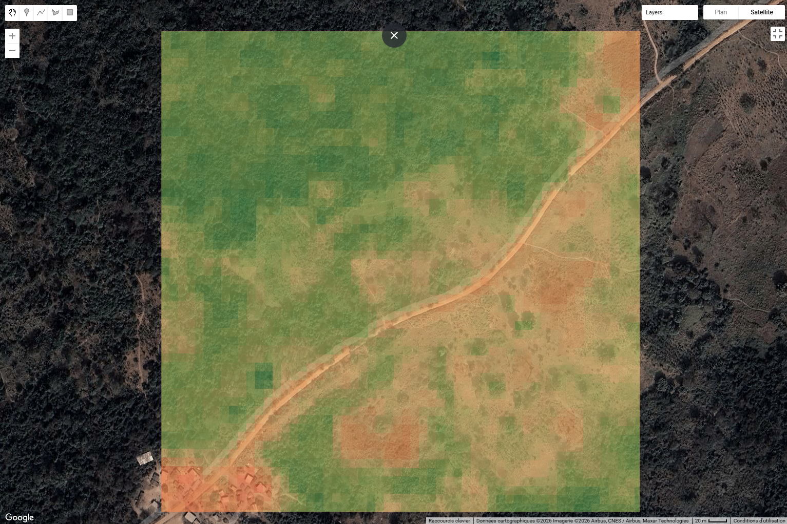

# Agri Geo Monitoring

## What it does

Agri Geo Monitoring est un système de surveillance agricole basé sur l'analyse d'images satellitaires (Sentinel-2) via Google Earth Engine. Il calcule le NDVI (Indice de Végétation par Différence Normalisée) sur des parcelles définies, détecte les variations significatives de la santé végétale, attribue un score de risque et stocke l'historique dans une base de données PostGIS. Une API REST permet de consulter ces données pour une intégration facile dans des tableaux de bord.

## Architecture

```mermaid
flowchart LR
  A[Sentinel-2 SR Harmonized] --> B[GEE Extract + SCL cloud mask]
  B --> C[NDVI t0 / NDVI t1]
  C --> D[Variation %]
  D --> E[Risk Score V1]
  E --> F[(PostGIS geo.parcel_runs)]
  F --> G[FastAPI]
  G --> H[/risk/{parcel_id}]
  G --> I[/risk/{parcel_id}/history]
```

## Quickstart

1.  **Démarrer la base de données :**
    ```bash
    docker compose up -d
    ```

2.  **Lancer l'ingestion des données (Analyse GEE) :**
    ```bash
    # Analyse pour la date par défaut (Juin 2024)
    python src/ingest_run.py
    
    # Ou pour une date spécifique
    python src/ingest_run.py --date 2024-03-01
    ```

3.  **Démarrer l'API :**
    ```bash
    uvicorn api.main:app --reload
    ```

## API

### 1. Obtenir le dernier risque pour une parcelle

`GET /risk/{parcel_id}`

**Exemple :**
`GET /risk/parcel_demo_001`

**Réponse :**
```json
{
  "parcel_id": "parcel_demo_001",
  "latest_run_id": 4,
  "ndvi_t0": 0.07,
  "ndvi_t1": 0.10,
  "variation_pct": 45.0,
  "risk_score": 10,
  "created_at": "2026-02-17T12:45:16+00:00"
}
```

### 2. Obtenir l'historique des risques

`GET /risk/{parcel_id}/history?limit=10`

**Exemple :**
`GET /risk/parcel_demo_001/history`

**Réponse :**
```json
[
  {
    "run_id": 4,
    "ndvi_t0": 0.07,
    "ndvi_t1": 0.10,
    "variation_pct": 45.0,
    "risk_score": 10,
    "created_at": "...",
    "date": "2024-07-01"
  },
  ...
]
```

## Demo Outputs

### latest /risk/parcel_demo_001

```json
{
  "parcel_id": "parcel_demo_001",
  "latest_run_id": 4,
  "ndvi_t0": 0.07123154831372469,
  "ndvi_t1": 0.10332966059560303,
  "variation_pct": 45.06165181263337,
  "risk_score": 10,
  "created_at": "2026-02-17T12:48:04.650845+00:00"
}
```

### history /risk/parcel_demo_001/history?limit=10

```json
[
  {
    "run_id": 4,
    "ndvi_t0": 0.07123154831372469,
    "ndvi_t1": 0.10332966059560303,
    "variation_pct": 45.06165181263337,
    "risk_score": 10,
    "created_at": "2026-02-17T12:48:04.650845+00:00",
    "date": "2024-07-01"
  },
  {
    "run_id": 3,
    "ndvi_t0": 0.08871929347515106,
    "ndvi_t1": 0.12643758952617645,
    "variation_pct": 42.514193058013916,
    "risk_score": 10,
    "created_at": "2026-02-17T12:48:03.436699+00:00",
    "date": "2024-04-01"
  },
  {
    "run_id": 2,
    "ndvi_t0": 0.062137603759765625,
    "ndvi_t1": 0.10123443603515625,
    "variation_pct": 62.919782570422535,
    "risk_score": 10,
    "created_at": "2026-02-17T12:48:02.122179+00:00",
    "date": "2024-03-01"
  },
  {
    "run_id": 1,
    "ndvi_t0": 0.10891990258771293,
    "ndvi_t1": 0.071197509765625,
    "variation_pct": -34.633116801991054,
    "risk_score": 90,
    "created_at": "2026-02-17T11:48:29.620165+00:00",
    "date": "2024-06-01"
  }
]
```

## Scoring Logic (V1)

Le score de risque est calculé en fonction de la variation en pourcentage du NDVI (`variation_pct`) entre la période T0 (passé) et T1 (actuel).

| Variation NDVI (%) | Score de Risque | Signification |
| :--- | :--- | :--- |
| **<= -20%** | **90** | **Critique** (Forte baisse de végétation) |
| **]-20%, -10%]** | **70** | **Élevé** (Baisse modérée) |
| **]-10%, 0%[** | **40** | **Moyen** (Légère baisse) |
| **>= 0%** | **10** | **Faible** (Stable ou en croissance) |

*Note: Si aucune donnée n'est disponible, le score est `null`.*

## Cloud Masking (SCL)

Pour garantir la fiabilité des mesures NDVI, nous utilisons la bande **SCL (Scene Classification Layer)** de Sentinel-2 pour masquer les pixels indésirables avant le calcul de la médiane.

**Classes filtrées (exclues) :**
- 3: Ombre de nuage
- 7: Non classifié
- 8: Nuage probabilité moyenne
- 9: Nuage probabilité élevée
- 10: Cirrus fins
- 11: Neige / Glace

## Limitations

1.  **Nuages résiduels :** Malgré le filtrage SCL, certains nuages fins ou bords de nuages peuvent subsister et fausser légèrement le NDVI à la baisse.
2.  **Saisonnalité :** La simple variation T0 vs T1 ne distingue pas une baisse "normale" due à la saison sèche d'une baisse "anormale". Une comparaison inter-annuelle serait plus robuste.
3.  **Polygone de démo :** Le système est actuellement configuré pour un polygone unique codé en dur (`parcel_demo_001`). Il faudra le rendre dynamique.
4.  **Latence GEE :** Les requêtes Earth Engine peuvent prendre quelques secondes, ce qui n'est pas idéal pour du temps réel (d'où l'architecture asynchrone avec base de données).

## Visualisation

Exemple de sortie NDVI (Janvier-Mars 2024, Saison Sèche) :


